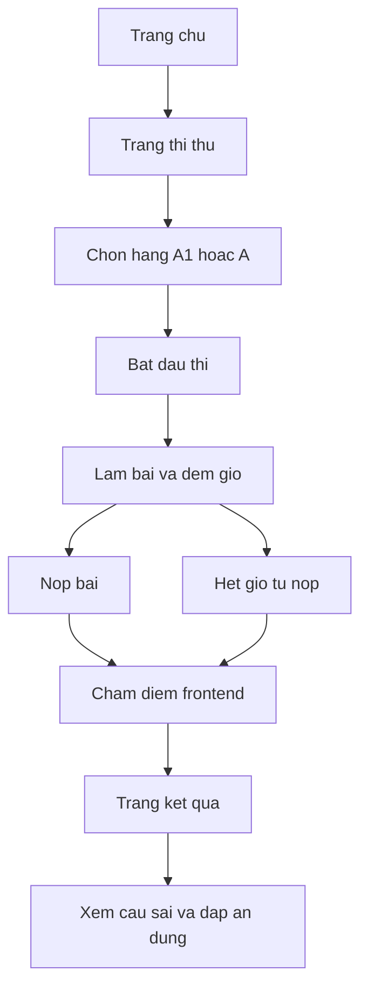

# Kế hoạch Frontend-first cho hệ thống thi bằng lái xe máy

## 1 Mục tiêu giai đoạn hiện tại
- Việt hóa toàn bộ giao diện hiện có
- Chuyển toàn bộ nội dung website sang ngữ cảnh thi bằng lái xe máy
- Hoàn thiện chức năng thi thử phía frontend cho hạng A1 và A
- Chưa tích hợp backend ở giai đoạn này, dùng dữ liệu đề thi tạm trong JavaScript

## 2 Phạm vi triển khai giai đoạn frontend
- Chỉnh sửa toàn bộ trang HTML hiện có
- Thêm trang thi thử và trang kết quả
- Cập nhật điều hướng để người dùng truy cập luồng thi thử nhanh
- Bổ sung logic làm bài, đếm giờ, nộp bài, chấm điểm, xem lại đáp án

## 3 File dự kiến tác động
- index.html
- about.html
- courses.html
- feature.html
- appointment.html
- team.html
- testimonial.html
- contact.html
- 404.html
- js/main.js
- css/style.css
- Tạo mới exam.html
- Tạo mới result.html

## 4 Thiết kế chi tiết trang thi thử frontend
### 4.1 Luồng người dùng
1 vào trang thi thử
2 chọn hạng A1 hoặc A
3 nhấn bắt đầu thi
4 làm bài và theo dõi thời gian
5 nộp bài hoặc hệ thống tự nộp khi hết giờ
6 xem kết quả tổng quan
7 xem danh sách câu sai và đáp án đúng

### 4.2 Quy tắc cấu hình
- Hạng A1 dùng cấu hình mặc định hiện hành và đặt tập trung trong biến cấu hình
- Hạng A cho phép chỉnh trong mã để linh hoạt theo nhu cầu

```js
const EXAM_CONFIG = {
  A1: {
    totalQuestions: 25,
    durationMinutes: 19,
    passScore: 21,
  },
  A: {
    totalQuestions: 25,
    durationMinutes: 19,
    passScore: 21,
  },
}
```

### 4.3 Cấu trúc dữ liệu đề thi tạm
```js
const QUESTION_BANK = {
  A1: [
    {
      id: 'A1-001',
      question: 'Noi dung cau hoi',
      options: ['Lua chon 1', 'Lua chon 2', 'Lua chon 3', 'Lua chon 4'],
      correctIndex: 0,
      explanation: 'Giai thich dap an',
      critical: false,
    },
  ],
  A: [
    {
      id: 'A-001',
      question: 'Noi dung cau hoi',
      options: ['Lua chon 1', 'Lua chon 2', 'Lua chon 3', 'Lua chon 4'],
      correctIndex: 1,
      explanation: 'Giai thich dap an',
      critical: false,
    },
  ],
}
```

## 5 Kế hoạch Việt hóa và đổi nội dung toàn site
- Đổi `lang` từ en sang vi trên tất cả trang
- Việt hóa toàn bộ navbar, breadcrumb, heading, button, footer
- Đổi thương hiệu và nội dung từ trường dạy lái xe sang hệ thống thi bằng lái xe máy
- Cập nhật CTA chính thành bắt đầu thi thử

## 6 Kế hoạch chỉnh sửa từng trang
- Trang chủ: nhấn mạnh thi thử A1 và A, có nút vào trang thi
- Trang giới thiệu: mô tả mục tiêu nền tảng luyện thi
- Trang khóa học: đổi thành bộ đề và chương trình ôn tập
- Trang tính năng: nêu chấm tự động, đếm giờ, xem đáp án
- Trang lịch hẹn: đổi sang đăng ký tư vấn ôn thi
- Trang đội ngũ: đổi thành đội ngũ hỗ trợ học luật giao thông
- Trang đánh giá: phản hồi thí sinh đã thi đạt
- Trang liên hệ: Việt hóa toàn phần
- Trang 404: Việt hóa thông báo lỗi

## 7 Kế hoạch triển khai JavaScript frontend
- Tạo module quản lý trạng thái bài thi
- Render câu hỏi theo hạng bằng
- Bắt sự kiện chọn đáp án và lưu lựa chọn
- Đồng hồ đếm ngược theo cấu hình hạng bằng
- Nộp bài thủ công hoặc tự động khi hết giờ
- Chấm điểm và tính trạng thái đạt hoặc chưa đạt
- Render trang kết quả gồm điểm, số câu đúng sai, danh sách câu sai

## 8 Kế hoạch kiểm thử thủ công frontend
- Kiểm thử điều hướng menu và liên kết trang
- Kiểm thử không còn chuỗi tiếng Anh ở các trang chính
- Kiểm thử luồng thi thử đầy đủ cho A1
- Kiểm thử luồng thi thử đầy đủ cho A
- Kiểm thử tình huống hết giờ tự nộp
- Kiểm thử hiển thị kết quả và đáp án đúng

## 9 Lộ trình giai đoạn 2 sau khi xong frontend
- Chuyển sang ASP.NET Core MVC theo cấu trúc Models Views Controllers
- Di chuyển giao diện HTML sang Razor Views và Layout dùng chung
- Tách logic thi khỏi dữ liệu tĩnh để gọi API
- Kết nối SQL Server để quản lý ngân hàng đề và lịch sử làm bài

## 10 Định hướng API + SQL Server ở giai đoạn sau
- API nhóm đề thi
  - Lấy cấu hình theo hạng bằng
  - Lấy danh sách câu hỏi theo đề
- API nhóm nộp bài
  - Nhận đáp án thí sinh
  - Trả kết quả chấm điểm và chi tiết sai đúng
- API nhóm quản trị
  - Quản lý câu hỏi và đáp án
  - Quản lý bộ đề theo hạng bằng

## 11 Sơ đồ luồng frontend

